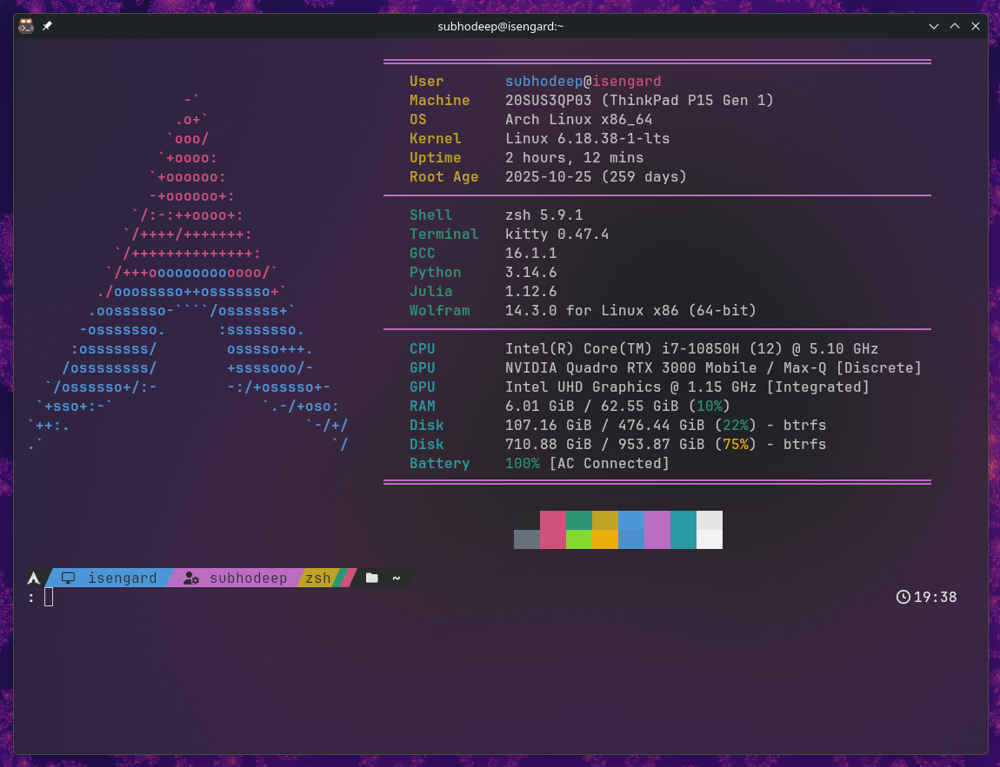

# Dotfiles

A collection of configuration files for the terminal environment and desktop workflow.



## Components

* **Terminal:** [Kitty](https://sw.kovidgoyal.net/kitty/)
* **Shell:** [Zsh](https://www.zsh.org/) (Plugins managed via [Oh My Zsh](https://ohmyz.sh/))
* **Prompt:** [Starship](https://starship.rs/)
* **System Info:** [Fastfetch](https://github.com/fastfetch-cli/fastfetch)
* **Window Management:** [Krohnkite](https://codeberg.org/anametologin/Krohnkite) (KDE Tiling Script, bindings saved in `kglobalshortcutsrc`)

## Management

Configurations are maintained via a local backup script (`backup.sh`). This script copies the active configurations from their respective system directories into this repository for version control.

### Backup Workflow

```bash
# Pull latest local configs into the repository
./backup.sh

# Commit and push
git add .
git commit -m "Update configurations"
git push
