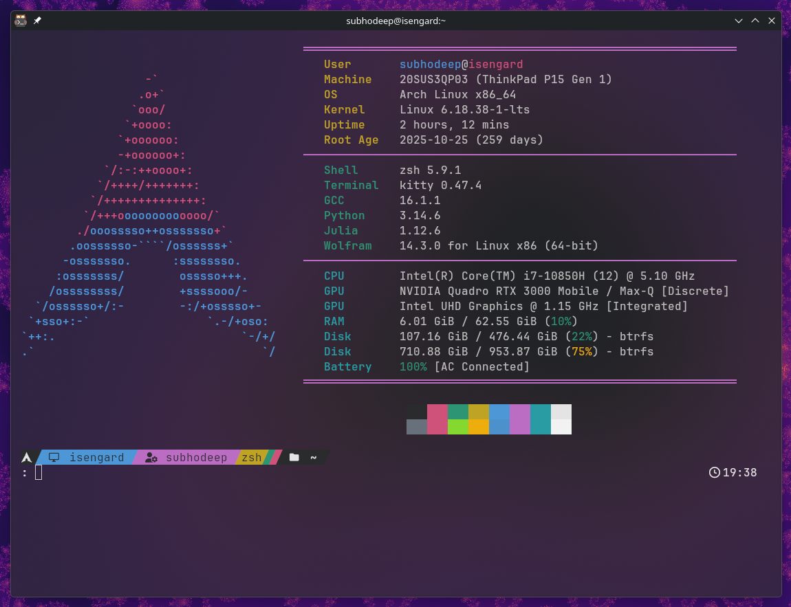

# Dotfiles

A collection of configuration files for the terminal environment and desktop workflow, plus system configs, package lists and environment specs for this Arch Linux ThinkPad.



## Components

* **Terminal:** [Kitty](https://sw.kovidgoyal.net/kitty/)
* **Shell:** [Zsh](https://www.zsh.org/) (Plugins managed via [Oh My Zsh](https://ohmyz.sh/))
* **Prompt:** [Starship](https://starship.rs/)
* **System Info:** [Fastfetch](https://github.com/fastfetch-cli/fastfetch)
* **Window Management:** [Krohnkite](https://codeberg.org/anametologin/Krohnkite) (KDE Tiling Script, bindings saved in `kglobalshortcutsrc`, rules in `kwinrc`)
* **Command Snippets:** [Pet](https://github.com/knqyf263/pet)
* **Editor:** [VS Code](https://code.visualstudio.com/) (settings, keybindings and extension list)
* **References:** [Zotero](https://www.zotero.org/) (preferences and extension list)
* **Python Environments:** [uv](https://docs.astral.sh/uv/) (venv specs and upgrade script)
* **Apps:** [Flatpak](https://flathub.org/) (installed apps and permission overrides)

## Repository Layout

```
dotfiles/
├── .zshrc, starship.toml       # Shell and prompt
├── kitty/, fastfetch/, pet/    # App configs from ~/.config
├── kglobalshortcutsrc, kwinrc  # KDE shortcuts and Krohnkite rules
├── mimeapps.list               # Default applications
├── scripts/                    # ~/scripts
├── vscode/                     # settings.json, keybindings.json, extensions.txt
├── zotero/                     # prefs.js, extensions.txt
├── venvs/                      # upgrade-numerics.sh + <env>.lock/ specs
├── system-configs/             # /etc files, bootloader, package lists, Flatpak,
│                               # Python and Julia envs (see its README.md)
├── templates/                  # README_SYS.md, copied to system-configs/README.md
├── screenshot/
└── tmp/                        # Scratch space, ignored by git
```

## Management

Configurations are maintained via a local backup script (`backup.sh`). This script copies the active configurations from their respective system directories into this repository for version control.

It also captures system files from `/etc` and the EFI partition (asks for the sudo password), official, AUR and Flatpak package lists, and Python and Julia environment specs.

### Backup Workflow

```bash
# Pull latest local configs into the repository
./backup.sh

# Review what changed (check for tokens or passwords before pushing)
git status
git diff

# Commit and push
git add .
git commit -m "Update configurations"
git push
```

### Python Environment Upgrades

The venvs in `~/venvs` are upgraded with `~/venvs/upgrade-numerics.sh`, which is backed up to `venvs/` along with each env's `requirements.in`, `requirements.txt`, `uv.env` and `smoke.py`. Run the backup script after an upgrade so the new lockfiles are committed.

```bash
~/venvs/upgrade-numerics.sh                  # numerics
~/venvs/upgrade-numerics.sh -e pytorch_env   # pytorch_env
./backup.sh
```

## Restore

> [!CAUTION]
> Restore **system** files by hand, following [`system-configs/README.md`](system-configs/README.md). It covers the restore order, package lists, Flatpak, the bootloader and the Python and Julia environments.

The user configs below can be copied directly.

### Shell & Terminal

Install Oh My Zsh first, since its installer replaces `~/.zshrc`, then copy the configs. Reinstall any plugins referenced in `.zshrc`.

```bash
cp .zshrc ~/
cp starship.toml ~/.config/
cp -r kitty fastfetch pet ~/.config/
cp -r scripts ~/
```

### KDE & Krohnkite

Install the Krohnkite script first, then copy the files and log out and back in.

```bash
cp kglobalshortcutsrc kwinrc mimeapps.list ~/.config/
```

### VS Code

```bash
mkdir -p ~/.config/Code/User
cp vscode/settings.json vscode/keybindings.json ~/.config/Code/User/
xargs -n1 code --install-extension < vscode/extensions.txt
```

### Zotero

Close Zotero, then copy `zotero/prefs.js` into the profile folder (`~/.zotero/zotero/<profile>.default/`, or under `~/.var/app/org.zotero.Zotero/` for the Flatpak version). Reinstall the extensions listed in `zotero/extensions.txt`.